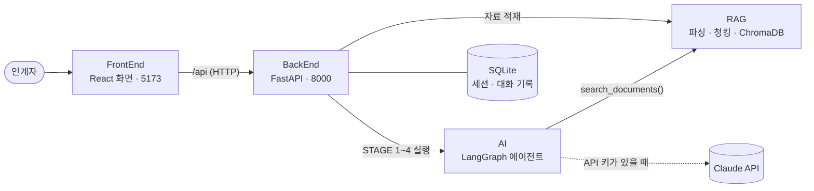

# AMIGO RAG — 문서 파싱 · 청킹 · 벡터 검색 모듈

AI 기반 인수인계서 자동 작성 시스템 **AMIGO** 의 데이터/RAG 계층입니다.
업무 자료(PDF·한글·Word·메일·소스코드·컨플루언스/나누미 링크 …)를 텍스트로 바꾸고, 의미 단위로 쪼개 출처 꼬리표(파일명·페이지·발신자 등)를 붙여
ChromaDB 에 저장하며, AI 에이전트가 호출할 검색 함수 `search_documents()` 를 제공합니다.

> 이 저장소는 BackEnd 가 불러 쓰는 **파이썬 라이브러리**라서 혼자 띄우는 서버가 없습니다.
> 화면까지 전체를 실행하려면 [실행 방법](#실행-방법), 이 모듈만 다루려면 [이 저장소만 개발하기](#이-저장소만-개발하기)를 보세요.

<!-- 공통 섹션 시작 — 4개 저장소(RAG·AI·BackEnd·FrontEnd) README 에 같은 내용이 들어 있습니다. 고칠 때는 네 곳을 함께 고쳐 주세요. -->

## 전체 구성

AMIGO 는 인계자가 올린 업무 자료를 AI 가 먼저 분석하고, 자료에 없는 내용만 골라 한 번에 하나씩 질문해서
**근거(출처)가 달린 인수인계서**를 완성하는 시스템입니다. 저장소 네 개가 하나의 시스템을 이룹니다.



| 저장소 | 하는 일 | 주요 기술 |
|---|---|---|
| [FrontEnd](https://github.com/AMIGO-KFTC/FrontEnd) | 자료 업로드(드래그 앤 드롭·링크), 진행 단계 표시, 메신저형 질의응답, 문서 뷰어·PDF/Word 다운로드 | React 19, Vite, TypeScript |
| [BackEnd](https://github.com/AMIGO-KFTC/BackEnd) | API 서버, 세션·자료·대화 DB, 업로드 파일 보관 → RAG 적재, 에이전트 백그라운드 실행, 문서 내보내기 | FastAPI, SQLAlchemy |
| [AI](https://github.com/AMIGO-KFTC/AI) | STAGE 1~4 상태 머신, 빈 항목 질문, 검색 도구 호출(Agentic RAG), 근거가 달린 문서 합성 | LangGraph, Claude API |
| **[RAG](https://github.com/AMIGO-KFTC/RAG)** (이 저장소) | PDF·HWPX·Word·메일 등 파싱, 청킹·출처 메타데이터, 하이브리드 검색 `search_documents()` | ChromaDB, pdfplumber |

BackEnd 가 AI·RAG 를 **파이썬 패키지로 불러와** 한 프로세스에서 함께 실행합니다.
그래서 띄울 서버는 **BackEnd(8000 포트)** 와 **FrontEnd 개발 서버(5173 포트)** 두 개뿐입니다.

| 단계 | 화면 | 하는 일 |
|---|---|---|
| STAGE 1 자료 분석 | 진행률 바 | 인수인계서 6개 장(업무 소개·이해관계자·정기 업무·비정기 업무·시스템 접근 계정·부서별 특이사항)별로 자료를 검색하고, 모자라면 AI 가 스스로 다시 검색 |
| STAGE 2 분석 요약 | 장별 🟢충분 🟡부분 🔴부족 | 자료로 채운 것과 비어 있는 것을 정리 |
| STAGE 3 질의응답 | 메신저형 채팅 | 빈 항목을 중요한 순서대로 **한 번에 하나씩** 질문 → 답변 정리 → "이렇게 정리했는데 맞나요?" 교차 확인 |
| STAGE 4 문서 생성 | 인수인계서 탭 | 표와 근거 번호가 달린 문서, PDF/Word 다운로드, 채팅으로 고칠 점을 말하면 새 버전 생성 |

## 실행 방법

처음 받는 사람 기준으로 **설치 → 실행 → 데모**를 순서대로 정리했습니다. 패키지를 내려받는 첫 설치는 보통 5분 안팎 걸립니다.
API 키가 없어도 규칙 기반 **오프라인 엔진**으로 전체 흐름이 동작합니다. Claude 를 쓰려면 [3. 환경 설정](#3-환경-설정-env)에서 키만 넣으면 됩니다.

### 0. 준비물

| 도구 | 버전 | 설치 |
|---|---|---|
| Git | 아무 버전 | <https://git-scm.com> |
| Python | **3.11 ~ 3.13** (3.12 권장) | macOS: `brew install python@3.12`<br>Ubuntu 24.04: `sudo apt install python3 python3-venv`<br>Windows: <https://www.python.org/downloads/> — 설치 첫 화면에서 **Add python.exe to PATH** 체크 |
| Node.js | **22 LTS** (20.19 이상) | <https://nodejs.org> 에서 LTS 버전, macOS: `brew install node@22` |
| Claude API 키 | 선택 | <https://console.anthropic.com> 에서 발급. 없으면 오프라인 엔진으로 동작 |

설치 확인: `git --version`, `python3 --version`(Windows: `python --version`), `node --version`

- 디스크 여유 공간 약 1GB(파이썬 패키지 약 650MB, npm 패키지 약 160MB)가 필요하고, 첫 설치 때 PyPI·npm 에 접속합니다.
  사내망에서 막히면 [8. 문제 해결](#8-문제-해결)의 프록시·미러 설정을 보세요.
- macOS 에 기본으로 들어 있는 `python3`(3.9)는 쓸 수 없습니다. 위 명령으로 3.12 를 설치하면 설치 스크립트가 알아서 찾아 씁니다.

### 1. 저장소 받기

네 저장소를 **한 폴더 안에 나란히** 받습니다. BackEnd 가 `../RAG`, `../AI`, `../FrontEnd` 경로로 나머지를 찾으므로 폴더 이름을 바꾸지 마세요.

```bash
mkdir amigo && cd amigo
git clone https://github.com/AMIGO-KFTC/RAG.git
git clone https://github.com/AMIGO-KFTC/AI.git
git clone https://github.com/AMIGO-KFTC/BackEnd.git
git clone https://github.com/AMIGO-KFTC/FrontEnd.git
```

```text
amigo/
├── RAG/        문서 파싱 · 검색 모듈
├── AI/         LangGraph 에이전트
├── BackEnd/    API 서버  ← 설치·실행 스크립트가 여기에 있습니다
└── FrontEnd/   화면
```

> 기본 브랜치가 아닌 브랜치(예: 아직 병합 전인 작업 브랜치)로 실행하려면 받은 뒤 각 폴더에서 `git switch <브랜치명>` 을 실행하세요.

### 2. 설치 (처음 한 번)

BackEnd 의 설치 스크립트가 다음을 한 번에 처리합니다.

1. RAG·AI 저장소가 옆에 있는지 확인
2. 파이썬 가상환경 `BackEnd/.venv` 를 만들고 RAG·AI·BackEnd 패키지를 설치
   (RAG·AI 는 *editable* 설치라서 코드를 고치면 다시 설치하지 않아도 바로 반영됩니다)
3. `BackEnd/.env` 가 없으면 `.env.example` 을 복사
4. FrontEnd 의 npm 패키지 설치

**macOS / Linux**

```bash
cd BackEnd
./scripts/setup.sh
```

**Windows (PowerShell)**

```powershell
cd BackEnd
powershell -ExecutionPolicy Bypass -File scripts\setup.ps1
```

마지막에 `✔ 준비 완료`(Windows 는 `Done.`)가 보이면 성공입니다. 다시 실행해도 안전합니다(있는 것은 그대로 두고 빠진 패키지만 설치).
파이썬이 여러 개 깔려 있으면 쓸 파이썬을 지정할 수 있습니다: `PYTHON=python3.12 ./scripts/setup.sh`
(Windows: `powershell -ExecutionPolicy Bypass -File scripts\setup.ps1 -Python C:\경로\python.exe`)

<details>
<summary>스크립트 없이 직접 설치하기</summary>

macOS / Linux:

```bash
cd BackEnd
python3.12 -m venv .venv
source .venv/bin/activate
python -m pip install --upgrade pip
pip install -r requirements-dev.txt      # -e ../RAG, -e ../AI 가 함께 설치됩니다
cp .env.example .env
cd ../FrontEnd && npm install
```

Windows (PowerShell):

```powershell
cd BackEnd
py -3.12 -m venv .venv
.venv\Scripts\Activate.ps1
python -m pip install --upgrade pip
pip install -r requirements-dev.txt
copy .env.example .env
cd ..\FrontEnd; npm install
```

</details>

### 3. 환경 설정 (.env)

설정 파일은 `BackEnd/.env` 하나입니다. **처음에는 그대로 두고 실행해도 됩니다.**

| 하고 싶은 것 | `BackEnd/.env` 에 적을 내용 |
|---|---|
| API 키 없이 시연 (기본) | 그대로 두기 → 규칙 기반 오프라인 엔진 |
| Claude 로 실제 분석 | `ANTHROPIC_API_KEY=sk-ant-...` |
| 모델 바꾸기 | `AMIGO_LLM_MODEL=claude-haiku-4-5`(기본, 가장 저렴) / `claude-sonnet-5-5`(약 2배) / `claude-opus-5-5`(약 4배, 품질 가장 좋음) |
| 키가 있어도 오프라인 엔진으로 | `AMIGO_LLM_MODE=offline` |
| Claude API 비용 상한 두기 | `AMIGO_LLM_BUDGET_USD=10` (모든 작업 합계가 $10 를 넘으면 새 AI 작업을 막음, 0 이면 제한 없음) |
| 컨플루언스 링크 수집 | `CONFLUENCE_BASE_URL` + `CONFLUENCE_PAT`(Server/DC), Cloud 는 `CONFLUENCE_EMAIL` + `CONFLUENCE_API_TOKEN` |
| 나누미 링크 수집 | `NANUMI_BASE_URL` + `NANUMI_COOKIE` |

- Claude 를 쓰면 작업 화면 오른쪽 위에 이번 작업의 **추정 비용·토큰 수**가, 시작 화면에 **전체 누적 사용량과 남은 예산**이 표시됩니다(배지에 마우스를 올리면 자세히). 추정치이므로 실제 청구액은 <https://platform.claude.com> 의 Usage 에서 확인하고, 그곳의 Limits 에서 월 사용 한도도 걸어 두세요.
- `.env` 를 고친 뒤에는 백엔드를 껐다가 다시 켭니다(코드 변경 시 자동 재시작은 `.env` 변경을 감지하지 않습니다).
- 지금 쓰는 엔진은 작업 화면 오른쪽 위 배지(`Claude · claude-haiku-4-5` / `오프라인 규칙 엔진`)나
  <http://localhost:8000/api/health> 의 `"engine"` 값(`claude` / `offline`)으로 확인합니다.
- `.env` 는 `.gitignore` 에 들어 있어 커밋되지 않습니다. API 키를 `.env.example`·코드·채팅에 적지 마세요.
- 오프라인 엔진은 표 머리글과 정규식으로 항목을 뽑는 **시연용**이라 문장이 거칠고 질문도 정해진 틀을 씁니다. 실제 품질은 Claude 로 확인하세요.
- 전체 설정 목록은 [BackEnd README 의 환경변수](https://github.com/AMIGO-KFTC/BackEnd#환경변수)에 있습니다.

### 4. 실행

터미널을 두 개 열어 백엔드와 프론트엔드를 각각 실행합니다.

**터미널 1 — 백엔드(API 서버)**

macOS / Linux:

```bash
cd BackEnd
./scripts/dev.sh
```

Windows (PowerShell):

```powershell
cd BackEnd
powershell -ExecutionPolicy Bypass -File scripts\dev.ps1
```

`Application startup complete.` 가 보이면 준비된 것입니다. <http://localhost:8000/docs> 에서 API 문서(Swagger)를 볼 수 있습니다.

**터미널 2 — 프론트엔드(화면)** — 모든 OS 공통

```bash
cd FrontEnd
npm run dev
```

브라우저에서 **<http://localhost:5173>** 을 엽니다. 화면의 `/api` 요청은 Vite 개발 서버가 백엔드(8000)로 전달합니다.

**한 번에 실행하기** — 둘 다 띄우는 스크립트도 있습니다.

macOS / Linux: 터미널 하나에서 함께 실행되고 `Ctrl+C` 로 둘 다 종료됩니다.

```bash
cd BackEnd
./scripts/start-all.sh
```

Windows (PowerShell): 백엔드·프론트엔드 창이 하나씩 새로 열립니다.

```powershell
cd BackEnd
powershell -ExecutionPolicy Bypass -File scripts\start-all.ps1
```

- **코드를 고치면** 바로 반영됩니다. 백엔드는 BackEnd·AI·RAG 의 `.py` 파일이 바뀌면 스스로 다시 시작하고, 화면은 저장하는 즉시 바뀝니다.
- 끌 때는 각 터미널에서 `Ctrl+C` 를 누릅니다.
- **8000 포트를 이미 쓰고 있다면** 다른 포트로 띄우고, 프론트엔드에도 그 주소를 알려 줍니다(예: 8001).

| | macOS / Linux | Windows (PowerShell) |
|---|---|---|
| 백엔드 | `PORT=8001 ./scripts/dev.sh` | `powershell -ExecutionPolicy Bypass -File scripts\dev.ps1 -Port 8001` |
| 프론트엔드 | `AMIGO_API=http://localhost:8001 npm run dev` | `$env:AMIGO_API="http://localhost:8001"; npm run dev` |
| 함께 실행 | `PORT=8001 ./scripts/start-all.sh` | `powershell -ExecutionPolicy Bypass -File scripts\start-all.ps1 -Port 8001` |

### 5. 데모 따라 하기 (5분)

RAG 저장소의 `samples/` 폴더(`amigo/RAG/samples/`)에 가상의 웹서비스팀 인수인계 자료 6종이 있습니다(등장하는 기관·인물·연락처는 모두 가상).

| 파일 | 내용 |
|---|---|
| `업무정의서_웹서비스팀.pdf` | 업무 개요, 주요 업무·반복 업무 표, 유관 부서, 유의사항 |
| `홈페이지_운영매뉴얼.hwpx` | 한글 문서: 사용 시스템과 권한 신청 방법 |
| `주간회의록_2026-09-22.docx` | 진행 중인 과제 현황(리뉴얼, 개인정보처리방침 개정 등) |
| `재무팀_유지보수대금_요청.eml` | 재무팀 메일(발신자·일시 메타데이터) + 첨부 검수 체크리스트 |
| `시스템_계정목록.xlsx` | 시스템 계정 목록, 연간 일정 |
| `웹접근성_개선계획.pptx` | 웹 접근성 지적사항과 추진 일정 |

1. <http://localhost:5173> 에서 **예시 채우기** → **인수인계 시작**
2. 왼쪽 **업무 자료** 칸에 `RAG/samples/` 의 파일 6개를 끌어다 놓습니다(칸을 클릭해서 골라도 됩니다). 모두 초록색 완료 표시가 될 때까지 기다립니다.
   - 링크 칸에 컨플루언스·나누미 주소를 붙여 넣고 **링크 추가** 를 누르면 링크도 자료로 등록됩니다.
     접속할 수 없는 주소면 빨간색 실패 표시와 사유가 나오고, 나머지 자료만으로 계속 진행할 수 있습니다.
3. **분석 시작** → 위쪽 진행 단계가 STAGE 1(장별 분석) → STAGE 2(요약)로 넘어가고, 오른쪽 **항목 충족 현황**이 채워집니다.
4. STAGE 3 — 대화창에 첫 질문이 옵니다. 아는 내용을 자유롭게 답하면 AI 가 정리해서 맞는지 되묻습니다.
   - 예: 재무팀 연락처를 물으면 `재무팀 박지훈 차장, 내선 2345` 라고 답하기 → 정리된 내용 확인 → **네, 맞아요**
   - 틀렸으면 고칠 내용을 그대로 적고, 모르는 질문은 **모르겠어요 (건너뛰기)** 를 누릅니다.
5. 질문이 끝나거나 **지금까지 내용으로 문서 생성** 을 누르면 STAGE 4 로 넘어가 **인수인계서** 탭에 문서가 나타납니다.
6. 문서 위쪽 버튼으로 **PDF / Word / Markdown** 을 내려받습니다. 표의 `[1]` 같은 번호는 문서 끝 **근거 자료** 목록(파일명·페이지·메일 발신자)과 연결됩니다.
7. 대화창에 `협업 관계에 총무팀 최OO 주임(내선 3456)도 추가해 주세요` 처럼 고칠 점을 보내면 반영된 **v2** 문서가 만들어집니다.

진행 상황은 서버에 저장되므로, 브라우저를 닫거나 서버를 다시 켜도 시작 화면의 **최근 작업**에서 이어서 할 수 있습니다.

### 6. (선택) 서버 하나로 실행하기 — 시연·공유용

화면을 빌드해 두면 백엔드가 화면까지 함께 제공하므로 8000 포트 하나로 동작합니다.

1. 화면 빌드: FrontEnd 폴더에서 `npm run build` → `FrontEnd/dist/` 가 생깁니다.
2. `BackEnd/.env` 에서 `# AMIGO_FRONTEND_DIST=../FrontEnd/dist` 줄 맨 앞의 `#` 을 지웁니다.
3. 백엔드를 [4. 실행](#4-실행)과 같이 띄우면 **<http://localhost:8000>** 에서 화면과 API 가 함께 열립니다.

같은 네트워크의 다른 PC 에서도 열어 보게 하려면 BackEnd 폴더에서 다음처럼 실행하고 `http://<내 PC IP>:8000` 으로 접속합니다.

```bash
.venv/bin/python -m uvicorn app.main:app --host 0.0.0.0 --port 8000        # Windows: .venv\Scripts\python -m uvicorn ...
```

**로그인이 없는 프로토타입**이므로 사내망 시연에만 쓰고, 실제 업무 자료를 다루는 서버는 사내 SSO 를 붙인 뒤에 운영하세요.

### 7. 테스트

모든 테스트는 오프라인 엔진으로 돌기 때문에 API 키 없이 실행됩니다. BackEnd 가상환경 하나로 세 파이썬 저장소를 모두 테스트할 수 있습니다.

macOS / Linux (amigo 폴더에서):

```bash
cd BackEnd     && .venv/bin/python -m pytest -q
cd ../RAG      && ../BackEnd/.venv/bin/python -m pytest -q
cd ../AI       && ../BackEnd/.venv/bin/python -m pytest -q
cd ../FrontEnd && npm run build
```

Windows (PowerShell, amigo 폴더에서):

```powershell
cd BackEnd;     .venv\Scripts\python -m pytest -q
cd ..\RAG;      ..\BackEnd\.venv\Scripts\python -m pytest -q
cd ..\AI;       ..\BackEnd\.venv\Scripts\python -m pytest -q
cd ..\FrontEnd; npm run build
```

| 저장소 | 확인하는 것 |
|---|---|
| BackEnd | 업로드 → 분석 → 질의응답 → 문서 생성 → 다운로드 API 통합 흐름, `.env` 읽기, Word/PDF 변환 |
| RAG | 형식별 파서(PDF·HWPX·HWP·Office·메일·ZIP), 청킹, 링크 수집 보안 검사, 하이브리드 검색 |
| AI | 상태 머신 전체 흐름(오프라인 엔진), 가짜 Anthropic 클라이언트로 Claude 호출 형식, 문서 렌더링 |
| FrontEnd | TypeScript 타입 검사 + 프로덕션 빌드 |

### 8. 문제 해결

| 증상 | 해결 |
|---|---|
| 설치 스크립트가 `RAG 가 없습니다` / `-e ../RAG` 설치 실패 | 네 저장소를 같은 폴더에 받았는지, 폴더 이름이 정확히 `RAG`, `AI`, `BackEnd`, `FrontEnd` 인지 확인 |
| `Python 3.9 은(는) 지원하지 않습니다` | Python 3.12 를 설치한 뒤 `PYTHON=python3.12 ./scripts/setup.sh` |
| Ubuntu: `ensurepip is not available` | `sudo apt install python3-venv`(3.12 를 따로 설치했다면 `python3.12-venv`) 후 다시 실행 |
| Windows: `이 시스템에서 스크립트를 실행할 수 없으므로 …` | `.ps1` 은 안내대로 `powershell -ExecutionPolicy Bypass -File …` 로 실행합니다. `npm` 이나 `Activate.ps1` 에서 같은 오류가 나면 `Set-ExecutionPolicy -Scope CurrentUser RemoteSigned` 를 한 번 실행하거나 `npm.cmd run dev` 처럼 실행 |
| 사내망에서 `pip install` / `npm install` 이 멈추거나 SSL 오류 | 프록시: `pip config set global.proxy http://프록시:포트`, `npm config set proxy http://프록시:포트`, `npm config set https-proxy http://프록시:포트`<br>사내 미러: `pip config set global.index-url <미러 주소>`, `npm config set registry <미러 주소>`<br>SSL 검사 장비가 있으면 회사 인증서 지정: `pip config set global.cert <인증서.pem>`, `npm config set cafile <인증서.pem>` |
| `npm run dev` 가 Node.js 버전 오류로 실패 | Node.js 22 LTS 로 올린 뒤 FrontEnd 에서 `npm install` 을 다시 실행 |
| 백엔드 실행 시 `address already in use` | 이미 떠 있는 서버를 끄거나 다른 포트로 실행([4. 실행](#4-실행)의 포트 변경 참고) |
| 화면에 `서버에 연결할 수 없습니다` | 백엔드가 떠 있는지 <http://localhost:8000/api/health> 로 확인. 포트를 바꿨다면 `AMIGO_API` 도 맞춰서 프론트엔드를 다시 실행 |
| 링크 등록이 실패(DNS·연결 오류) | 사내 위키·나누미는 사내망 PC 에서만 열립니다. 인증이 필요한 주소는 [3. 환경 설정](#3-환경-설정-env)의 컨플루언스·나누미 설정을 채우세요 |
| 내려받은 PDF 의 한글이 깨지거나 글꼴이 이상함 | 서버에 한글 TTF 글꼴이 없는 경우입니다. Linux: `sudo apt install fonts-nanum`, 또는 `.env` 에 `AMIGO_PDF_FONT=<글꼴 .ttf 경로>` 지정 후 백엔드 재시작 |
| `AI가 이전 요청을 처리하고 있어요` (409) | AI 가 앞 요청을 처리 중입니다. 대화창의 입력 중 표시(…)가 사라진 뒤 다시 보내세요 |
| 대화창에 오류 메시지와 **다시 시도** 버튼 | API 키·네트워크·사용량 한도 문제일 수 있습니다. 백엔드 터미널의 로그를 확인한 뒤 **다시 시도** |
| Linux 에서 `unsupported version of sqlite3` (ChromaDB) | 배포판의 sqlite 가 3.35 보다 오래된 경우입니다(Ubuntu 20.04, RHEL 8 등). Ubuntu 22.04 이상을 쓰거나 [uv](https://docs.astral.sh/uv/) 로 설치한 Python(`uv python install 3.12`)을 `PYTHON=` 으로 지정 |
| 처음 상태로 되돌리기 | 백엔드를 끄고 `BackEnd/data/` 폴더를 지우면 세션·업로드 파일·지식베이스가 모두 초기화됩니다 |

### 9. 최신 코드로 업데이트

네 저장소를 모두 최신으로 받은 뒤, 패키지가 바뀌었을 수 있으니 설치 스크립트를 한 번 더 실행합니다(이미 설치된 것은 건너뜀).

```bash
cd amigo
for repo in RAG AI BackEnd FrontEnd; do git -C $repo pull; done
cd BackEnd && ./scripts/setup.sh
```

Windows (PowerShell):

```powershell
cd amigo
foreach ($repo in "RAG", "AI", "BackEnd", "FrontEnd") { git -C $repo pull }
cd BackEnd; powershell -ExecutionPolicy Bypass -File scripts\setup.ps1
```

<!-- 공통 섹션 끝 -->

## 이 저장소만 개발하기

전체 설치(`BackEnd/scripts/setup.sh`)를 마쳤다면 BackEnd 가상환경에 이 저장소가 editable 로 설치되어 있으니 그대로 씁니다.

```bash
cd RAG
source ../BackEnd/.venv/bin/activate        # Windows: ..\BackEnd\.venv\Scripts\Activate.ps1
pytest -q
```

RAG 만 따로 받아 개발한다면 자체 가상환경을 만듭니다.

```bash
cd RAG
python3.12 -m venv .venv
source .venv/bin/activate                   # Windows: .venv\Scripts\Activate.ps1
pip install -e ".[dev]"                     # dev = pytest, reportlab(샘플 PDF 생성용)
pytest -q
```

### 명령줄 도구

가상환경을 켠 상태에서 `python -m amigo_rag`(또는 `amigo-rag`)로 파싱·적재·검색 결과를 바로 확인할 수 있습니다.

```bash
python -m amigo_rag parse  samples/업무정의서_웹서비스팀.pdf     # 파싱 결과(제목·문단·표 블록과 페이지)
python -m amigo_rag chunks samples/홈페이지_운영매뉴얼.hwpx     # 청크와 메타데이터
python -m amigo_rag ingest demo samples/*.pdf samples/*.hwpx samples/*.docx samples/*.eml samples/*.xlsx samples/*.pptx
python -m amigo_rag search demo "CMS 권한 신청 방법" -k 3       # 검색(score = 벡터 유사도와 키워드 일치율의 평균)
python -m amigo_rag sources demo                                 # 'demo' 지식베이스에 적재된 자료
python samples/make_samples.py data/samples                      # 샘플 자료 6종을 data/samples 에 새로 만들기
```

- 지식베이스는 `./data/rag/chroma` 에 저장됩니다(`AMIGO_RAG_DATA_DIR` 로 변경, `data/` 는 git 에서 제외).
- `samples/` 의 파일은 저장소에 들어 있으므로 다시 만들 필요가 없습니다. 생성기를 고쳤다면 위처럼 다른 폴더에 만들어 확인한 뒤 옮기세요
  (그 자리에서 다시 만들면 날짜 정보 때문에 6개 파일이 모두 바뀐 것으로 나옵니다).
- Windows PowerShell 은 `samples/*.pdf` 같은 와일드카드를 펼쳐 주지 않지만 `ingest` 가 직접 펼치므로 같은 명령을 그대로 쓰면 됩니다.
- 링크도 적재할 수 있습니다: `python -m amigo_rag ingest demo "https://wiki.example.com/pages/viewpage.action?pageId=123"`

### 폴더 구조

```text
src/amigo_rag/
  kb.py           KnowledgeBase: 적재(add_file · add_url · add_text) · 검색 · 자료 관리 — 다른 저장소가 쓰는 진입점
  parsers/        형식별 파서(pdf, hwpx, hwp, office, mail, html, text, archive) → ParsedDocument
  connectors/     링크 수집(컨플루언스 REST API, 나누미, 일반 웹) + SSRF 방지 HTTP 클라이언트
  chunking.py     제목·표·문장 단위 청킹과 메타데이터
  embeddings.py   오프라인 해시 임베딩 / sentence-transformers
  store.py        ChromaDB 저장소(세션별 컬렉션)
  retrieval.py    벡터 + BM25 하이브리드 검색(RRF)
  models.py       ParsedDocument · Chunk · SearchResult 데이터 구조
  textutil.py     파서·청커 공용 텍스트 처리
  config.py       환경변수 설정(RAGSettings)
  cli.py          명령줄 도구
samples/          가상 인수인계 자료 6종과 생성 스크립트(make_samples.py)
tests/            형식별 파서 · 청킹 · 링크 수집 · 검색 테스트
```

## 파이썬 API (AI · BackEnd 가 쓰는 인터페이스)

```python
from amigo_rag import KnowledgeBase, search_documents

kb = KnowledgeBase("session-123")                 # 인수인계 세션 1개 = 지식베이스 1개(Chroma 컬렉션)
kb.add_file("/tmp/업무정의서.pdf", source_id="src-1")   # 파일 적재 → IngestResult(chunk_count, warnings …)
kb.add_url("https://wiki.example.com/pages/viewpage.action?pageId=123")  # 컨플루언스/나누미/웹 링크
kb.add_text("유지보수 업체 담당자는 …", source_name="인계자 답변", source_type="chat")  # 대화로 얻은 정보

results = kb.search("홈페이지 담당자", top_k=5)    # list[SearchResult]
r = results[0]
r.text        # 청크 원문
r.citation    # "업무정의서.pdf p.3", "메일 '월간보고' (박지훈, 2026-09-30)", "컨플루언스: 운영 가이드"
r.score       # 0~1 관련도 (벡터 유사도와 키워드 일치율의 평균)
r.metadata    # 출처 메타데이터(아래 표)

# 모듈 함수 형태(설정은 환경변수 사용)
search_documents("홈페이지 담당자", kb_id="session-123", top_k=5)
```

검색 옵션: `source_types=["pdf","eml"]`, `source_ids=[...]`, `where={...}`(Chroma 문법), `per_source_limit=2`(자료별 최대 결과 수).
관리: `list_sources()`, `delete_source(source_id)`, `get_chunks(source_id)`, `stats()`, `clear()`.

## 지원 형식

| 형식 | 처리 방식 |
|---|---|
| PDF | pdfplumber 로 레이아웃(줄·제목·표) 분석. pdfminer 가 글자를 빠뜨리는 페이지는 PDFium 글자 좌표로 재구성, `(cid:…)` 깨짐은 PDFium 전체 텍스트로 대체. 스캔 페이지는 경고 |
| HWPX | ZIP+XML(OWPML) 직접 해석: spine 순서, `개요 N` 스타일 → 제목, 표 → 마크다운, 글상자·각주 포함, 실패 시 미리보기 텍스트 |
| HWP(5.0) | OLE 스트림 → raw-deflate 해제 → `PARA_TEXT` 레코드 디코딩. 암호 문서는 안내, 배포용 문서는 미리보기 텍스트 |
| DOCX / PPTX / XLSX | 본문 순서대로 문단·표, 제목 스타일, 목록 / 슬라이드 제목·표·발표자 노트 / 시트별 표(머리글 반복) |
| EML / MSG | 발신자·수신자·참조·일시·제목 메타데이터, HTML 본문 정리, **지원 형식 첨부파일 재귀 파싱**, `ks_c_5601-1987` 등 레거시 문자셋 |
| 소스코드·텍스트·MD·CSV | 확장자별 언어 표시, 줄바꿈 보존 분할 / CP949·UTF-8 자동 판별 |
| ZIP | 소스 묶음·자료 모음. 항목 수/용량 제한, CP949 파일명 복원, `node_modules`·`.git` 등 제외 |
| 링크 | 컨플루언스(REST API, Cloud/Server URL 모두), 나누미(쿠키/헤더 인증 범용 수집기), 일반 웹(HTML/PDF/텍스트) |

`.msg`(Outlook) 는 `pip install -e ".[msg]"` 로 `extract-msg` 를 추가 설치해야 읽습니다.
새 형식은 `(Path) -> ParsedDocument` 함수를 만들어 `parsers/__init__.py` 의 `PARSERS` 에 확장자를 등록하면 됩니다.

## 청킹과 메타데이터

- 제목이 나오면 새 청크를 시작하고 `section`(예: `업무정의서 > 2. 주요 업무`)을 남깁니다.
- 표는 통째로 유지하고, 크면 머리글 행을 반복하며 행 단위로 나눕니다. 긴 문단은 문장 단위로 나누고 앞 청크 끝부분을 겹쳐(overlap) 둡니다.
- 기본 `chunk_size=900`자, `chunk_overlap=150`자(한국어 기준 대략 400~600 토큰).

| 메타데이터 키 | 의미 |
|---|---|
| `source_id`, `source_name`, `source_type` | 등록 단위(업로드한 파일/링크) |
| `file_name`, `file_type`, `parent_name` | 실제 텍스트가 나온 파일(메일 첨부·ZIP 내부 파일이면 부모 이름 포함) |
| `page`, `page_end`, `sheet`, `section`, `chunk_index` | 위치 정보 |
| `sender`, `sender_name`, `recipients`, `cc`, `sent_at`, `subject` | 메일(첨부 청크도 상속) |
| `url`, `space`, `author`, `created_at`, `modified_at`, `title`, `language` | 링크·문서 속성 |

## 검색 방식

- **오프라인 기본 임베딩**: 한글 음절 2/3-gram + 단어 해싱(1024차원). 모델 다운로드가 필요 없어 사내망에서도 바로 동작합니다.
- **하이브리드 검색**: ChromaDB 벡터 검색 + BM25(한글 2-gram 토큰) → RRF 로 순위 융합. 사람 이름·시스템명 같은 고유명사에 강합니다.
- 의미 검색 품질을 높이려면 `pip install -e ".[st]"` 후 `AMIGO_RAG_EMBEDDING=st:jhgan/ko-sroberta-multitask`(또는 `st:BAAI/bge-m3`).
  처음 한 번 모델을 내려받으므로 인터넷(또는 사내 모델 미러)이 필요하고, 임베딩 설정을 바꾸면 기존 지식베이스는 다시 적재해야 합니다(섞어 쓰면 오류로 알려 줍니다).

## 환경변수

BackEnd 와 함께 실행할 때는 `BackEnd/.env` 에 적습니다(저장 위치는 BackEnd 가 `data/rag` 로 지정).

| 변수 | 기본값 | 설명 |
|---|---|---|
| `AMIGO_RAG_DATA_DIR` | `./data/rag` | ChromaDB 저장 위치(`<dir>/chroma`) — 단독 실행 시 |
| `AMIGO_RAG_EMBEDDING` | `hash` | `hash` 또는 `st:<모델명>` |
| `AMIGO_RAG_CHUNK_SIZE` / `AMIGO_RAG_CHUNK_OVERLAP` | `900` / `150` | 청크 크기(문자) |
| `AMIGO_RAG_MAX_FILE_MB` | `50` | 파일 크기 제한 |
| `CONFLUENCE_BASE_URL` | | 컨플루언스 주소(링크 유형 판별·컨텍스트 경로) |
| `CONFLUENCE_PAT` | | Server/DC 개인 액세스 토큰 |
| `CONFLUENCE_EMAIL`, `CONFLUENCE_API_TOKEN` | | Cloud 인증 |
| `NANUMI_BASE_URL`, `NANUMI_COOKIE`, `NANUMI_AUTH_HEADER` | | 나누미 주소와 인증 |
| `AMIGO_RAG_ALLOWED_HOSTS` | | 링크 수집 허용 도메인(쉼표 구분, 비우면 전체 허용) |
| `AMIGO_RAG_ALLOW_LOOPBACK` | `false` | 로컬 주소 링크 허용(개발용) |
| `AMIGO_RAG_HTTP_TIMEOUT`, `AMIGO_RAG_VERIFY_SSL` | `20`, `true` | 링크 수집 HTTP 설정 |

링크 수집은 서버가 대신 요청하므로 http/https 만 허용하고 링크로컬(169.254.x.x)·멀티캐스트·루프백 주소를 차단하며, 리다이렉트마다 다시 검사합니다.

## 다음 단계(확장 지점)

- **OCR**: 스캔 PDF/이미지(현재는 경고만). `parsers/pdf.py` 의 빈 페이지 처리 지점에 Tesseract 또는 비전 모델 연결
- **나누미 API**: 게시글 API 가 확정되면 `connectors/__init__.py::fetch_nanumi` 만 교체
- **임베딩 모델**: 사내 GPU/모델 서버가 있으면 `embeddings.py` 에 클래스 추가 후 `get_embedder` 에 등록
